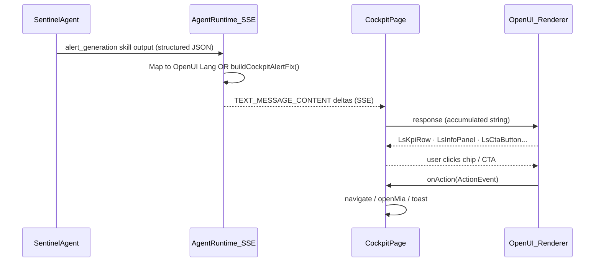

# Cockpit Agent → UI Contract

> **Primary doc for Cockpit's agent → transport → UI pipeline.**
> Read this alongside [`integration-roadmap.md`](integration-roadmap.md) (SSE notes) and [`component-mapping.md`](component-mapping.md) (OpenUI component registry).

---

## 1. Overview

The Cockpit page has two visual layers:

1. **Ambient agent widgets** — static structured cards (React components, no LLM at query time). Data comes from `GET /api/v1/cockpit` in production, or `useCockpitData()` mock in this POC.
2. **Generative detail panels** — OpenUI Lang streamed into `<Renderer>` when a user clicks an alert row. The agent (Sentinel, Media) composes or streams the OpenUI string in real time.

Every alert ends in an **action/inaction framing** (`LsActionInaction`) and a human-governed CTA (`LsCtaButton` → decision deep-link). This is the **decision-first** pattern from `ls4x`'s UX spec: surfaces drive action, not just information.

---

## 2. Architecture Diagram



**POC shortcut:** `createFakeSSEStream(fixture, chunkMs, chunkSize)` replaces the `AgentRuntime_SSE` step. The `Renderer` and `onAction` pipeline is identical.

---

## 3. Response Format Decision Matrix

| Content type | Format | Transport | UI consumer | POC example |
|---|---|---|---|---|
| Spend pacing table | Structured JSON | `useCockpitData()` (mock) / `GET /cockpit` | `cockpit-spend-section.tsx` | `CockpitMockData.spendRecommendations` |
| Sentinel alert detail | OpenUI Lang | SSE `TEXT_MESSAGE_CONTENT` | `<Renderer>` | `COCKPIT_FIXTURE` |
| Deterministic alert | OpenUI Lang (built from data) | `buildCockpitAlertFix()` | `<Renderer>` | Tier C path for unmapped rows |
| Media agent detail | OpenUI Lang | SSE `TEXT_MESSAGE_CONTENT` | `<Renderer>` | `COCKPIT_MEDIA_FIXTURE` |
| Data connector health | OpenUI Lang | SSE `TEXT_MESSAGE_CONTENT` | `<Renderer>` | `COCKPIT_DATA_FIXTURE` |
| MIA follow-up | OpenUI Lang | SSE via MIA panel | MiaPanel `<Renderer>` | `MIA_CAMPAIGNS_FIXTURE` |
| Widget shell chrome | React components | N/A | `CockpitWidgetHeader`, jump bar | Static widgets |
| Experiment alerts | Structured JSON | `useCockpitData()` | `cockpit-experiment-section.tsx` | `CockpitMockData.experimentAlerts` |

---

## 4. SSE Event Contract

```
# Wire format (unchanged from SSE spec in integration-roadmap.md)

data: {"type":"TEXT_MESSAGE_CONTENT","delta":"root = LsStack(\"vertical\", \"md\", ["}
data: {"type":"TEXT_MESSAGE_CONTENT","delta":"severity, alert, kpis...])"}
data: {"type":"TEXT_MESSAGE_CONTENT","delta":"\n  severity = LsSeverityBadge(\"high\"..."}
...
data: {"type":"RUN_FINISHED"}
```

**Chunking:** the backend streams OpenUI Lang in arbitrary byte chunks. The frontend accumulates every `delta` into a single string and passes it to `<Renderer response={accumulated}>`. Renderer handles partial strings gracefully (renders what it can parse; fills in the rest as chunks arrive).

**POC hook points:**
- `src/mocks/sseStream.ts` — `createFakeSSEStream(fixture, chunkMs, chunkSize)`
- `src/hooks/useOpenUIStream.ts` — accumulates chunks, manages progress + abort
- Production migration: replace `createFakeSSEStream` with a `fetch()` SSE reader pointing at `POST /api/v1/agents/sentinel/run` — see `integration-roadmap.md §3.1`.

---

## 5. Agent Output → OpenUI Component Mapping

### 5a. Sentinel Agent (`alert_generation` skill)

Maps to `AGENT_FRAMEWORK_SPEC.md §alert_generation` output shape.

| Agent skill output field | OpenUI component | Notes |
|---|---|---|
| `alert.title` | `LsInfoPanel` title (3rd arg) | Shown as card heading |
| `alert.body` | `LsInfoPanel` content (2nd arg) | Full explanation |
| `alert.severity` | `LsInfoPanel` variant (1st arg) + `LsSeverityBadge` | `"warning"` / `"error"` / `"info"` |
| `metrics[]` | `LsKpiRow` items array | Pace gap, revenue at risk, actual vs plan |
| `confidence` | `LsConfidenceBadge` level | `"high"` / `"medium"` / `"low"` |
| `recommended_steps[]` | `LsStepPlan` items | Sequential remediation plan |
| `action_summary` + `inaction_summary` | `LsActionInaction` | Executive action/inaction framing |
| `suggested_follow_ups[]` | `LsSuggestionChips` | Always the last element |
| `decision_deep_link` | `LsCtaButton` href | Human-governed — never auto-executes |

### 5b. Media Agent

| Agent output field | OpenUI component |
|---|---|
| `fatigue.score` | `LsSeverityBadge` + `LsInfoPanel` |
| `fatigue.ctr_decay[]` | `LsChart` (line, daily CTR vs baseline) |
| `fatigue.recommended_action` | `LsActionInaction` |
| `creative.name` / `impressions` | `LsKpiRow` items |
| `confidence` | `LsConfidenceBadge` |

---

## 6. Example Payloads

### 6a. Structured alert (backend JSON before OpenUI conversion)

```json
{
  "id": "alert-pace-001",
  "agent": "sentinel",
  "template": "budget_pace_guardrail",
  "channel": "Paid Social",
  "period": "Q4 Week 2",
  "metrics": {
    "actual_spend_wtd": 184000,
    "planned_spend_wtd": 240000,
    "pace_gap": 56000,
    "pacing_rate": 0.77,
    "revenue_at_risk": 714000
  },
  "severity": "high",
  "confidence": "high",
  "recommended_steps": [
    "Review Paid Social campaign delivery in Meta Ads Manager",
    "Increase daily budget by $8K/day across top-performing ad sets",
    "Create a decision in Lifesight to track approval"
  ],
  "action_summary": "Increase daily budget by $8K/day to recover pace by end of week.",
  "inaction_summary": "Leaving $56K unspent forgoes an estimated $714K incremental revenue.",
  "decision_deep_link": "/decisions/media-reallocation-001"
}
```

### 6b. OpenUI Lang (what SSE streams) — `COCKPIT_FIXTURE`

```
root = LsStack("vertical", "md", [hero, severity, alert, kpis, paceChart, badge, steps, cta, chips])
  hero = LsStatHero("Revenue at Risk", "$714K", -0.23, "if pace continues")
  severity = LsSeverityBadge("high", "Budget Pace — High Severity")
  alert = LsInfoPanel("warning", "Paid Social is pacing 23% below plan for week 2 of Q4. At current rate, $340K will go unspent by end-of-week, forgoing an estimated $714K incremental revenue.", "Budget Pace Alert — Paid Social")
  kpis = LsKpiRow([{label: "Actual Spend (WTD)", value: "$184K", delta: -0.23, positive_direction: false, spark: [...]}, ...])
  badge = LsConfidenceBadge("high", "Sentinel: high confidence", "Detected by Budget Pace Guardrail template")
  steps = LsStepPlan("Recommended response steps", ["Review Paid Social...", "Confirm budget caps...", ...])
  cta = LsCtaButton("Create Decision — Recover Paid Social Pace", "/decisions/media-reallocation-001", "primary")
  chips = LsSuggestionChips(["Show historical pace patterns", "What caused the delivery drop?", ...])
```

### 6c. SSE wire format

```
data: {"type":"TEXT_MESSAGE_CONTENT","delta":"root = LsStack(\"vertical\", \"md\", [hero, severity, "}
data: {"type":"TEXT_MESSAGE_CONTENT","delta":"alert, kpis, paceChart, badge, steps, cta, chips])\n"}
data: {"type":"TEXT_MESSAGE_CONTENT","delta":"  hero = LsStatHero(\"Revenue at Risk\", \"$714K\"..."}
...
data: {"type":"RUN_FINISHED"}
```

### 6d. Frontend consumption (TypeScript)

```ts
// src/features/cockpit/CockpitPage.tsx — simplified
const stream = useOpenUIStream()

// Tier B: pre-built fixture streamed via fake SSE
await stream.replay(COCKPIT_FIXTURE)

// Tier C: deterministic generation from structured data
const fixture = buildCockpitAlertFix(spendRecommendation)
await stream.replay(fixture)

// Render:
<OpenUIDemoRenderer
  stream={stream}
  onAction={handleAction}
  skeletonVariant="panel"
/>
// internally calls:
// <Renderer response={stream.response} library={library} isStreaming={stream.isStreaming} onAction={onAction} />
```

---

## 7. Widget Selection Flow (Cockpit UX)

```
User sees spend pacing table (CockpitSpendSection)
  └── clicks "Paid Social" row (status: under_pacing)
        ├── setSelectedAlertId("rec-paid-social")
        ├── look up ALERT_FIXTURE_MAP["rec-paid-social"] → COCKPIT_FIXTURE   ← Tier B
        │     OR buildCockpitAlertFix(rec)                                    ← Tier C
        ├── stream.replay(fixture)
        │     → createFakeSSEStream → readSSEStream → setResponse(accumulated)
        ├── scroll to #cockpit-alert-detail
        └── <CockpitAlertDetail> → <OpenUIDemoRenderer> → <Renderer>
              → renders LsStatHero, LsKpiRow, LsStepPlan, LsActionInaction, LsCtaButton...
              → user clicks LsCtaButton → onAction → navigate("/decisions/...")
```

---

## 8. MIA Integration

```ts
// Open MIA with cockpit context + pre-drafted prompt
openPanel({
  source: "Cockpit",
  module: "Campaigns",
})

// Widget-specific "Ask" buttons draft a context-aware prompt
// (pattern from ls4x openWithDraft — POC uses openPanel)
openPanel({
  source: "Cockpit",
  module: "Media Performance",
})
```

In production, the equivalent is `useMiaContext("cockpit")` which registers context so the global MIA panel pre-populates with relevant entities (brand, date window, module).

---

## 9. Production Integration Checklist

- [ ] Backend agent system prompt includes `SYSTEM_PROMPT` exported from `src/openui/library.ts`
- [ ] Sentinel `alert_generation` skill emits OpenUI Lang chunks, not plain markdown
- [ ] Cockpit REST payload stays **structured JSON** (`SpendRecommendation[]`, `ExperimentAlert[]`, etc.) — only the **expanded alert detail** is generative
- [ ] SSE stream uses `{"type":"TEXT_MESSAGE_CONTENT","delta":"..."}` + `{"type":"RUN_FINISHED"}` format
- [ ] `LsCtaButton` `href` values are validated deep-links into `/decisions/:id`
- [ ] Media Agent streams `COCKPIT_MEDIA_FIXTURE`-style layout (fatigue score, CTR decay chart, action/inaction)
- [ ] Data Agent streams `COCKPIT_DATA_FIXTURE`-style layout (connector readiness checklist)
- [ ] Widget headers show real agent live-state (from `readAgentLiveState()`, not hardcoded `true`)

---

## 10. POC Stubs vs Production

| Feature | POC | Production (ls4x) |
|---|---|---|
| Cockpit data | `useCockpitData()` (200ms mock, hardcoded NovaBrand) | `GET /api/v1/cockpit` → `getCockpitData()` |
| Alert SSE | `createFakeSSEStream(fixture, chunkMs, chunkSize)` | `PlannerAgentService` POST SSE → `readSSEStream` |
| Agent live state | Hardcoded flags in `CockpitMockData.agentLive` | `readAgentLiveState()` + localStorage events |
| Artifacts tab | Disabled stub | `useArtifacts()` + pinned `TabsTrigger` per artifact |
| Tier C builder | `buildCockpitAlertFix(rec: SpendRecommendation)` — frontend | Server-side, same logic, returns OpenUI Lang via REST field or SSE |
| MIA draft | `openPanel({ source, module })` (context only) | `openWithDraft(prompt)` (pre-fills MIA input) |
| DateWindowPicker | Not present in POC widgets | Renders date range inside each `WidgetHeader` |

---

## Troubleshooting

| Symptom | Likely cause | Fix |
|---|---|---|
| Blank Renderer | Fixture syntax error | Check for the inline red "components could not be rendered" banner. Verify all components are positional (not named-arg) and exist in `library.ts`. |
| Alert detail never streams | `selectAlert()` not finding fixture | Console.log `ALERT_FIXTURE_MAP[alertId]` — if undefined, add the id or let Tier C handle it |
| `buildCockpitAlertFix` returns fixture with `LsStack` containing template literals | Template literal in string | Ensure the function returns valid OpenUI Lang (no raw `${}` in output) |
| Jump bar scroll misses section | `scrollMarginTop` too small | Increase `style={{ scrollMarginTop: "3rem" }}` on agent section wrappers |
